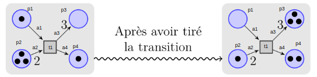
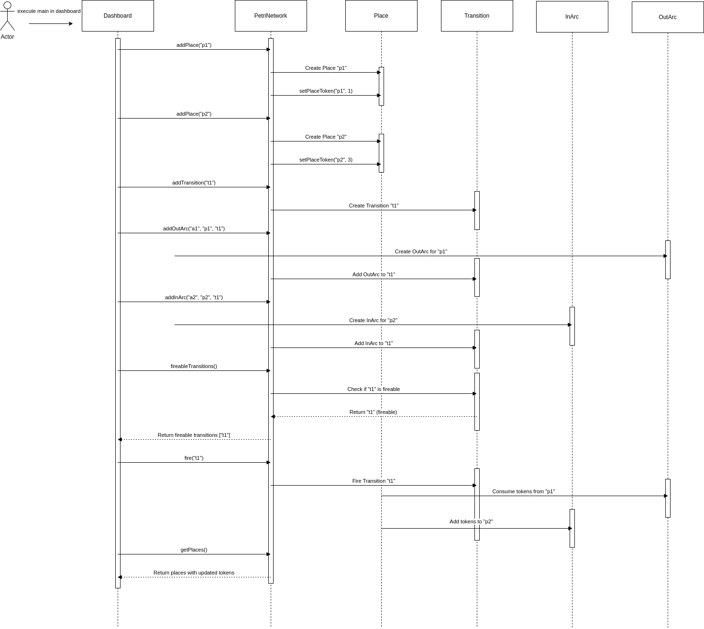
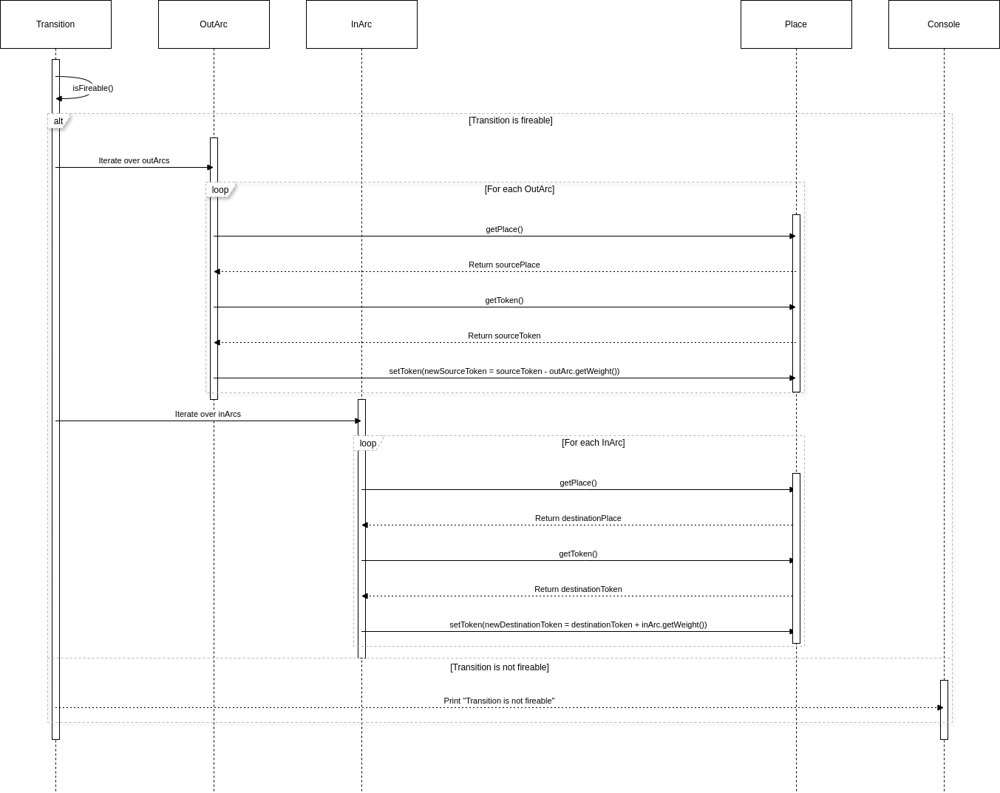
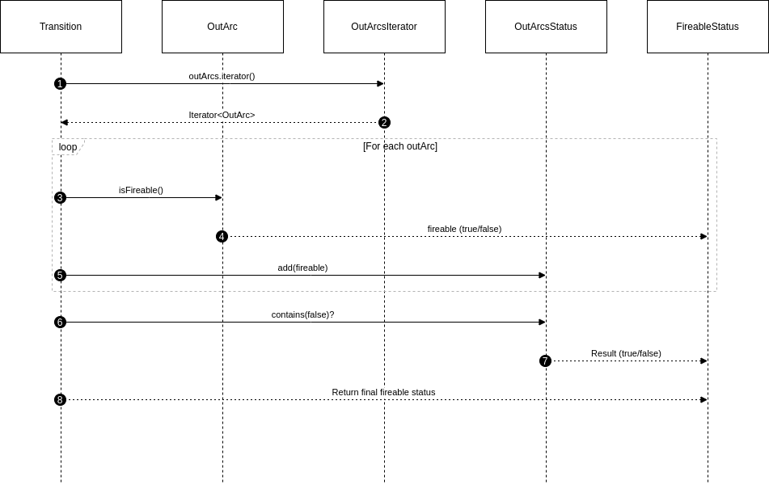
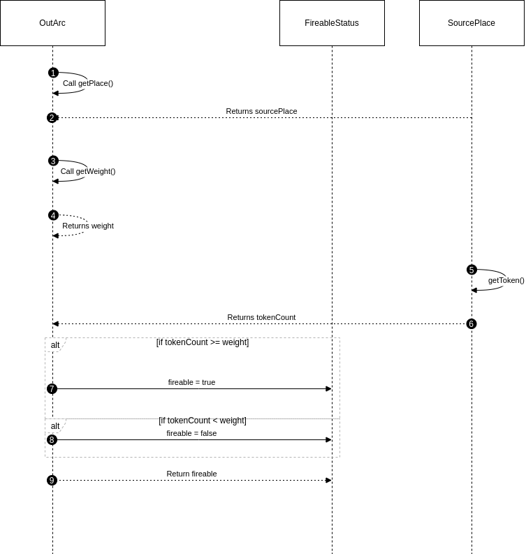

# Petri Network

The goal to this project is to implemeted a Petri Network's UML model.

The UML model was created to be aligned with the following prepositions:

## Elements

- Place: It can have a token quantity equals or greater than 0 (token >= 0). 
- Transition: It can be blocked or available depending on the place source's token and arc's weight (see more in ```special considerations```).  
- Arc: The default arc's weight is 1. Otherwise, it can be set by user and it must be a positive integer (w >= 1).

## Use cases
| Item | Description| 
|-----|-------------|
| 1   | User can select which transition run. |
| 2   | User can add / remove places, arcs, transitions |
| 3   | User can edit place's token quantity |
| 4   | User can edit arc's weight |

## Special considerations

1. The arc element is diveded in 2 types: **in_arc** and **out_arc** taking as reference the place (in_arc comes from a transition and ends in a place while out_arc outs from a place and ends in a transition).

2. A pair of ```place - transition``` can have an out_arc and in_arc at the same time, but it is not allowed to have 2 out_arcs or two in_arcs.

3. A transition is available only if all of the out_arcs' weights are equal or less than the place's token quantities.

4. When a transition is available, two things happen:

- The out_arc's weight is removed to the source place.
- The in_arc's weight is added to the destination place. **It means transitions are able to generate token to complete the in_arc's weight as needed by the destination place.**


## Modelling

### Class Diagram


### Sequence diagram


#### General execution


#### Fire()


#### isTransitionFireable()


### OutArcIsFireable()



