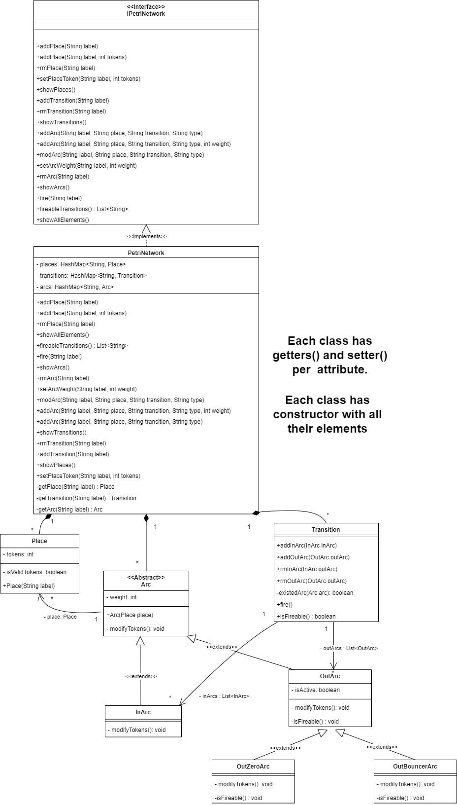
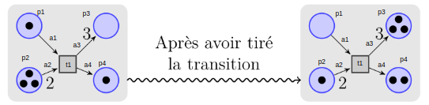

# Petri Network

Group 5 members:
* MIRANDA Anamaria.
* PEREZ-RAMIREZ Julian.

The goal to this project is to implemeted a Petri Network's UML model.

The UML model was created to be aligned with the following prepositions:

## Elements

- Place: It can have a token quantity equals or greater than 0 (token >= 0). 
- Transition: It can be blocked or available depending on the place source's token and arc's weight (see more in ```special considerations```).  
- Arc: The default arc's weight is 1. Otherwise, it can be set by user and it must be a positive integer (w >= 1).

## Use cases
| Item | Description| 
|-----|-------------|
| 1   | User can select which transition run. |
| 2   | User can add / remove places, arcs, transitions |
| 3   | User can edit place's token quantity |
| 4   | User can edit arc's weight |

## Special considerations

1. The arc element is diveded in 2 types: **in_arc** and **out_arc** taking as reference the place (in_arc comes from a transition and ends in a place while out_arc outs from a place and ends in a transition).

2. A pair of ```place - transition``` can have an out_arc and in_arc at the same time, but it is not allowed to have 2 out_arcs or two in_arcs.

3. A transition is available only if all of the out_arcs' weights are equal or less than the place's token quantities.

4. When a transition is available, two things happen:

- The out_arc's weight is removed to the source place.
- The in_arc's weight is added to the destination place. **It means transitions are able to generate token to complete the in_arc's weight as needed by the destination place.**


## Modelling

### Class Diagram


### How to run

In the `Dashboard.java` file you can find the main function to execute the program. There is a Petri Network already created to emulated the behavior of the following example:


The code to describe this network is:
```
PetriNetwork net = new PetriNetwork();
List<String> fireableTransitions;
			
//First Transition
net.addPlace("p1", 1);
net.addPlace("p2", 3);
net.addPlace("p3");// by default token is 0
net.addPlace("p4", 1);
			
net.addTransition("t1");
			
net.addArc("a1", "t1", "p1", "out");
net.addArc("a2", "t1", "p2", "out", 2);
net.addArc("a3", "t1", "p3", "in", 3);
net.addArc("a4", "t1", "p4", "in"); // by default weight is 1

net.showAllElements();
List<String> fireableTransitions = net.fireableTransitions();
net.fire(fireableTransitions.get(0)); // t1
```

This code fires the transition `t1` because of the `out arcs` meet the condition to be "fireable". For that, the place's token are updated as following:

|Place|Before|After|
|------|-----|-----|
|p1|1|0|
|p2|3|1|
|p3|0|3|
|p4|1|2|

The execution gives the following output in the console:
```
Places:
{p1=Place has 1, p2=Place has 3, p3=Place has 0, p4=Place has 1}
Transitions:
{t1=InArcs[Arc has weight 3, Arc has weight 1]OutArcs[Arc has weight 1 and it is true, Arc has weight 2 and it is true]}
Arcs:
{a1=Arc has weight 1 and it is true, a2=Arc has weight 2 and it is true, a3=Arc has weight 3, a4=Arc has weight 1}
[t1]
Before fire transition
{p1=Place has 1, p2=Place has 3, p3=Place has 0, p4=Place has 1}
Firing ...
After fire transition
{p1=Place has 0, p2=Place has 1, p3=Place has 3, p4=Place has 2}
```


