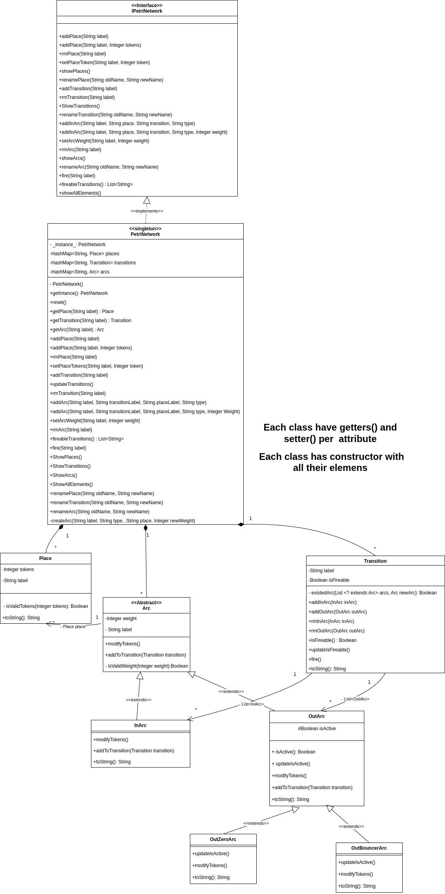

# Petri Network

Group 5 members:
* MIRANDA RODRIGUEZ Anamaria.
* PEREZ-RAMIREZ Julian.

The goal to this project is to implemeted a Petri Network's UML model.

## How to clone

Copy and paste this into your folder destination. You must have configured your SSH before trying to clone this repo.
```
git clone git@gitlab-df.imt-atlantique.fr:a24miran/petrinetwork.git
```

## How to run

In the **`Main.java`** file you can find the main function to execute the program. There is a Petri Network already created to emulated the behavior of the following example:


The code to describe this network is:
```
PetriNetwork net = new PetriNetwork();
// Places
net.addPlace("p1");
net.addPlace("p2", 1);
net.addPlace("p3");
net.addPlace("p4");
net.addPlace("p5", 1);
			
// Transitions
net.addTransition("t1");
net.addTransition("t2");
net.addTransition("t3");
net.addTransition("t4");
			
//Out Arcs (having place as a reference)
net.addArc("a1_out", "t1", "p1", "out");
net.addArc("a2_out", "t2", "p2", "out");
net.addArc("a3_out", "t1", "p3", "out");
net.addArc("a4_out", "t4", "p4", "out");
net.addArc("a5_out", "t3", "p5", "out");
net.addArc("a6_out", "t3", "p3", "out");
			
//In Arcs (having place as a reference)
net.addArc("a1_in", "t2", "p1", "in");
net.addArc("a2_in", "t1", "p2", "in");
net.addArc("a3_in", "t2", "p3", "in");
net.addArc("a4_in", "t3", "p4", "in");
net.addArc("a5_in", "t4", "p5", "in");
net.addArc("a6_in", "t4", "p3", "in");
			
net.showAllElements();
```

This code produces the following output:
```
4 places
4 transitions
12 arcs
Place's list:
1: p1 with 0 tokens, 1 OutArcs, 1 InArcs
2: p2 with 1 tokens, 1 OutArcs, 1 InArcs
3: p3 with 0 tokens, 2 OutArcs, 2 InArcs
4: p4 with 0 tokens, 1 OutArcs, 1 InArcs
5: p5 with 1 tokens, 1 OutArcs, 1 InArcs
Transition's list:
1: t1, 2 OutArcs, 1 InArcs,
2: t2, 1 OutArcs, 2 InArcs
3: t3, 2 OutArcs, 1 InArcs,
4: t4, 1 OutArcs, 2 InArcs
Arc's list:
1: a1_out, OutArc with weight 1 (from place with 0 tokens to transition) 
2: a2_out, OutArc with weight 1 (from place with 1 tokens to transition)
3: a3_out, OutArc with weight 1 (from place with 0 tokens to transition)
4: a4_out, OutArc with weight 1 (from place with 0 tokens to transition)
5: a5_out, OutArc with weight 1 (from place with 1 tokens to transition)
6: a6_out, OutArc with weight 1 (from place with 0 tokens to transition)
7: a1_in, InArc with weight 1 (from transition to place with 0 tokens)
8: a2_in, InArc with weight 1 (from transition to place with 1 tokens)
9: a3_in, InArc with weight 1 (from transition to place with 0 tokens)
10: a4_in, InArc with weight 1 (from transition to place with 0 tokens)
11: a5_in, InArc with weight 1 (from transition to place with 1 tokens)
12: a6_in, InArc with weight 1 (from transition to place with 0 tokens)
```

To see, which transitions are fireable, you must call the method:
```
net.fireableTransitions();
```

This prints the following output:
```
[t2, t3]
```

To fire one of these transitions, call the function:
```
net.fire("t2");
```

This fire transition `t2`, and prints the network with updated place's tokens:
```
Place's list:
1: p1 with 1 tokens, 1 OutArcs, 1 InArcs
2: p2 with 0 tokens, 1 OutArcs, 1 InArcs
3: p3 with 1 tokens, 2 OutArcs, 2 InArcs
4: p4 with 0 tokens, 1 OutArcs, 1 InArcs
5: p5 with 1 tokens, 1 OutArcs, 1 InArcs
```

The UML model was created to be aligned with the following prepositions:

## Elements

- Place: It can have a token quantity equals or greater than 0 (token >= 0). 
- Transition: It can be blocked or available depending on the place source's token, arc's weight and arc's type (see more in ```special considerations```).  
- Arc: The default arc's weight is 1. Otherwise, it can be set by user and it must be a positive integer (w >= 1).

## Use cases
| Item | Description| 
|-----|-------------|
| 1   | User can select which transition run. |
| 2   | User can add / remove places, arcs, transitions |
| 3   | User can edit place's token quantity |
| 4   | User can edit arc's weight |

## Special considerations

1. The arc element is diveded in 2 types: **in_arc** and **out_arc** taking as reference the place (in_arc comes from a transition and ends in a place while out_arc outs from a place and ends in a transition).

2. A pair of ```place - transition``` can have an out_arc and in_arc at the same time, but it is not allowed to have 2 out_arcs or two in_arcs.

3. A transition is available only if all of the out_arcs' weights are equal or less than the place's token quantities; or there is no out_arcs and it has at least 1 in_arc to give tokens.

4. When a transition is available, two things happen:

- The out_arc's weight is removed to the source place.
- The in_arc's weight is added to the destination place. **It means transitions are able to generate token to complete the in_arc's weight as needed by the destination place.**


5. There are 2 special types of aout_arcs: Out Zero Arcs and Out Bouncer Arcs. 
- **Out Zero Arcs** actives the transition if and only if the place source has 0 tokens, but it doesn't modify the place's tokens. It does not remove tokens. 
- **Out Bouncer Arcs**  actives the transition if the source place's tokens is greather or equal to 1, and it takes all place tokens at once. It means, when the transition is fired, if source place has 1 or 100 tokens, all tokens will be removed from that place.

## Modelling

### Class Diagram


### Project Structure

```
PetriNetwork
└── src
     ├── main
     │   └── java
     │       └── mapd
     │           ├── exceptions
     │           │   ├── ElementNameNotExists.java
     │           │   ├── InvalidTokenNumber.java
     │           │   ├── InvalidWeightNumber.java
     │           │   ├── RepeatedArc.java
     │           │   └── RepeatedNameElement.java
     │           ├── implementations
     │           │   ├── Arc.java
     │           │   ├── Dashboard.java
     │           │   ├── InArc.java
     │           │   ├── OutArc.java
     │           │   ├── OutBouncerArc.java
     │           │   ├── OutZeroArc.java
     │           │   ├── PetriNetwork.java
     │           │   ├── Place.java
     │           │   └── Transition.java
     │           └── interfaces
     │               └── IPetriNetwork.java
     └── test
         └── java
             └── mapd
                 ├── InArcTest.java
                 ├── OutArcTest.java
                 ├── PetriNetworkTest.java
                 ├── PlaceTest.java
                 └── TransitionTest.java
```


